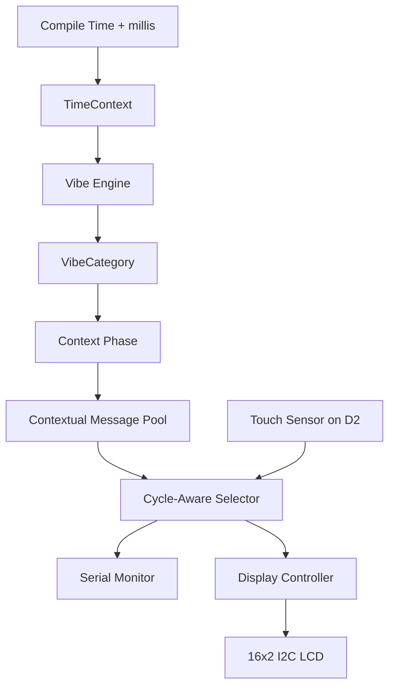

# Kalachakram 🎯

Traditional clocks suffer from one major design flaw: they tell you the exact time.

Kalachakram is an intentionally unhelpful, fully offline Arduino clock for TinkerHub Useless Projects 3.0. It internally tracks approximate time, determines the current time-vibe and where it is inside that vibe, then displays a sarcastic contextual phrase instead of the useful answer.

```text
Internal diagnostics: 19:43, EVENING, MIDDLE

Public LCD:
WORK?
QUESTIONABLE.
```

Kalachakram does not randomly choose a vibe. Time deterministically selects both the main vibe and the current EARLY/MIDDLE/LATE context. Randomness only varies the ordering of valid phrases inside that contextual pool, and every phrase in the pool is used before that pool repeats.

V0.5 adds one concession to the user: touching a connected digital touch sensor immediately skips to the next valid phrase. It still refuses to reveal the exact time.

## Basic Details

### Team Name: Jilebi

### Team Members

- Team Lead: Rifan C Afsal - Muthoot Institute of Technology and Science
- Member 2: Sreehari R Nair - Muthoot Institute of Technology and Science

### Project Description

Kalachakram maintains approximate software wall-clock time using the sketch's compilation time and elapsed runtime. It classifies the day into eight main vibes, divides each vibe into EARLY, MIDDLE, and LATE phases, and selects from 96 phase-specific two-line messages.

Serial Monitor exposes the internal time, vibe, and phase for debugging. The physical 16×2 I²C LCD stays committed to the joke and displays only the selected vague phrase.

### The Problem (that doesn't exist)

Ordinary clocks are far too cooperative. They provide exact information immediately, leaving no room for uncertainty, sarcasm, or a tiny machine judging your schedule.

### The Solution (that nobody asked for)

Know the time internally, refuse to reveal it properly, and offer observations such as `SUN IS UP. / I AM NOT.` or `BASICALLY SIX. / DON'T ARGUE.` instead.

## Current Status

### Implemented

- Fully offline Arduino operation.
- Approximate software-maintained time using `__TIME__ + millis()`.
- Fixed-size `TimeContext` with hour, minute, and second.
- Eight deterministic main vibe categories.
- Three deterministic context phases per vibe: EARLY, MIDDLE, and LATE.
- 24 contextual message pools.
- Four messages per contextual pool: 96 messages total.
- Full-pool repeat prevention using a small used-bit mask.
- Immediate-repeat prevention across pool-cycle boundaries.
- Immediate reselection when the vibe or context phase changes.
- Non-blocking phrase refresh every 60 seconds.
- Refresh scheduling updates its timestamp only after a message is selected, preventing ordinary loop iterations from postponing the next refresh.
- Debounced, edge-triggered touch-to-skip input on configurable Arduino pin D2.
- One message skip per distinct touch; holding the sensor does not continuously cycle phrases.
- Touch skips use the existing contextual pool and full-pool repeat prevention.
- Flash-backed message storage using AVR `PROGMEM`.
- Fixed-size 16×2-safe message buffers.
- Serial diagnostics at 9600 baud.
- 16×2 I²C LCD output through a dedicated Display Controller.
- Standalone I²C scanner utility.
- Compile-time hardware-independent logical test mode.

### Physically Verified

- V0.4 compiles and uploads to an actual Arduino Uno.
- V0.4 runs successfully on the physical Arduino Uno.
- Serial output works on the physical prototype.
- The 16×2 I²C LCD displays Kalachakram messages.
- The current V0.4 prototype behavior is reported working.
- The four-wire Arduino Uno/I²C LCD circuit was also validated in Tinkercad.

Exact V0.4 compiler memory figures and the scanner-reported physical address were not recorded.
The current V0.5 source, including the V0.4.1 refresh hotfix, compiles for Arduino Uno with Arduino CLI 1.5.1, Arduino AVR Boards 1.8.8, and LiquidCrystal I2C 1.1.2. The build uses 10,454 bytes of Flash (32%) and 592 bytes of SRAM (28%). Physical verification of the new refresh and touch behavior is still pending.
V0.5 touch input has not yet been physically verified.

### Pending / Final Polish

- Arduino Uno upload and physical verification of consecutive 60-second refreshes.
- Confirm the physical touch module's voltage, active polarity, and signal connection before upload.
- V0.5 Arduino Uno compile/upload and physical touch-to-skip verification.
- Final enclosure and physical presentation.
- Submission screenshots.
- Build photographs.
- Demo video.
- Final presentation and demo polish.

## Technical Details

### Technologies/Components Used

For Software:

- Arduino C/C++.
- Arduino AVR core.
- `Wire`, supplied with the Arduino core, for I²C communication.
- External `LiquidCrystal_I2C` Arduino library for the LCD.
- AVR program-memory utilities through `avr/pgmspace.h`.
- Arduino IDE and Serial Monitor.

Current dependencies:

| Type | Dependency | Purpose |
|---|---|---|
| Arduino core | `Arduino.h` | Runtime, `millis()`, Serial, randomness, and Flash-string helpers |
| Arduino core library | `Wire.h` | I²C bus communication |
| External Arduino library | `LiquidCrystal_I2C.h` | 16×2 LCD initialization and output |
| Standard integer types | `stdint.h` | Fixed-width integer types |
| Arduino AVR core/toolchain | `avr/pgmspace.h` | `PROGMEM`, `strcpy_P`, `strlen_P`, and `pgm_read_byte` |

For Hardware:

- Arduino Uno.
- 16×2 LCD with attached I²C backpack.
- Digital-output touch sensor module; the current source expects active-HIGH output on D2.
- Breadboard.
- Jumper wires.
- USB cable.
- Laptop running Arduino IDE.

### Time, Vibe, and Context Model

The main vibe is selected deterministically from the hour:

| Time | Vibe |
|---|---|
| 00:00–04:59 | `CURSED_HOURS` |
| 05:00–07:59 | `TOO_EARLY` |
| 08:00–10:59 | `MORNING` |
| 11:00–12:59 | `LUNCH_LOADING` |
| 13:00–15:59 | `AFTERNOON` |
| 16:00–17:59 | `DAY_IS_DYING` |
| 18:00–20:59 | `EVENING` |
| 21:00–23:59 | `GO_TO_BED` |

Each vibe is divided into three equal-duration phases using integer seconds-since-midnight arithmetic:

| Vibe | EARLY | MIDDLE | LATE |
|---|---|---|---|
| `CURSED_HOURS` | 00:00:00–01:39:59 | 01:40:00–03:19:59 | 03:20:00–04:59:59 |
| `TOO_EARLY` | 05:00:00–05:59:59 | 06:00:00–06:59:59 | 07:00:00–07:59:59 |
| `MORNING` | 08:00:00–08:59:59 | 09:00:00–09:59:59 | 10:00:00–10:59:59 |
| `LUNCH_LOADING` | 11:00:00–11:39:59 | 11:40:00–12:19:59 | 12:20:00–12:59:59 |
| `AFTERNOON` | 13:00:00–13:59:59 | 14:00:00–14:59:59 | 15:00:00–15:59:59 |
| `DAY_IS_DYING` | 16:00:00–16:39:59 | 16:40:00–17:19:59 | 17:20:00–17:59:59 |
| `EVENING` | 18:00:00–18:59:59 | 19:00:00–19:59:59 | 20:00:00–20:59:59 |
| `GO_TO_BED` | 21:00:00–21:59:59 | 22:00:00–22:59:59 | 23:00:00–23:59:59 |

Randomness never controls time, vibe, or phase. It only orders the four valid messages in the active vibe/phase pool.

### Contextual Message Selection

The message database contains:

```text
8 vibes × 3 phases × 4 messages = 96 messages
```

Each pool uses a four-bit used mask. Only unused message indexes are eligible, so all four messages are shown once before that pool starts another cycle. The final message of one cycle is also excluded from the first selection of the next cycle, preventing an immediate boundary repeat.

A vibe or phase change starts a fresh cycle for the new context.

### Message Storage and Arduino Uno Constraints

The Flash-backed message table is declared as:

```cpp
const char vibe_messages[8][3][4][2][17] PROGMEM;
```

The dimensions represent eight vibes, three phases, four messages per pool, two lines per message, and 17 bytes per line including null termination. Every current visible line is at most 16 characters.

Only the selected message is copied into two small fixed-size RAM buffers. The firmware uses no Arduino `String`, dynamic allocation, or STL containers.

### Implementation

For Software:

# Installation

1. Clone or download the repository.
2. Keep the root `.ino`, `.h`, and `.cpp` files together in the `Kalachakram` sketch directory.
3. Open `Kalachakram.ino` in Arduino IDE.
4. Select **Arduino Uno** and the correct serial/COM port.
5. Confirm that the Arduino AVR core and `Wire` library are available.
6. Install a compatible `LiquidCrystal_I2C` library exposing `init()`, `backlight()`, `setCursor()`, and `print()`.
7. If setting up another LCD, run the standalone scanner and update `KALACHAKRAM_LCD_ADDRESS` with its result.
8. Confirm that the touch module is safe at 5 V, then connect its digital signal to D2. If it uses another pin or active polarity, update the two configuration values in `touch_controller.h`.

The committed source currently configures `KALACHAKRAM_LCD_ADDRESS` as `0x27`. This is a source configuration value, not a recorded scanner-confirmed physical measurement.

# Run

1. Connect the Arduino Uno and LCD using the four-wire table below.
2. Compile and upload `Kalachakram.ino`.
3. Open Serial Monitor at **9600 baud**.
4. Observe internal `TIME`, `VIBE`, `PHASE`, and `MESSAGE` diagnostics.
5. Confirm that the physical LCD displays only the two selected phrase lines.
6. Normal phrase refresh occurs approximately every 60 seconds; vibe and phase changes trigger immediate reselection.
7. Touch and release the sensor; the LCD should immediately advance once to another message from the same contextual pool, and the next automatic interval starts from that selection.

### Source Code Structure

| File | Responsibility |
|---|---|
| `Kalachakram.ino` | Main orchestration, non-blocking scheduling, Serial diagnostics, test-mode integration, and display dispatch |
| `time_engine.h`, `time_engine.cpp` | Approximate software timekeeping from compilation time plus elapsed `millis()` |
| `vibe_engine.h`, `vibe_engine.cpp` | Main vibe classification and deterministic EARLY/MIDDLE/LATE phase calculation |
| `messages.h`, `messages.cpp` | Flash-backed contextual phrase bank, validation, and cycle-aware selection |
| `display_controller.h`, `display_controller.cpp` | 16×2 I²C LCD initialization and fixed-width two-row rendering |
| `touch_controller.h`, `touch_controller.cpp` | Configurable digital touch input, non-blocking debounce, and one-event-per-touch detection |
| `tools/i2c_scanner/i2c_scanner.ino` | Standalone diagnostic for discovering devices on the I²C bus |

### Output Examples

These messages come directly from the current V0.4 phrase bank:

```text
MIDNIGHT PASSED.
BAD DECISION.
```

```text
SUN IS UP.
I AM NOT.
```

```text
LUNCH IS
APPROACHING.
```

```text
BASICALLY SIX.
DON'T ARGUE.
```

```text
WORK?
QUESTIONABLE.
```

```text
NIGHT IS
GETTING IDEAS.
```

```text
SLEEP EXISTS.
REMEMBER?
```

### Testing

#### Source / Static Validation

- The committed initializer contains 96 messages: 12 per vibe and four per contextual pool.
- All 192 visible lines fit within 16 characters.
- The message table remains in `PROGMEM`.
- Source inspection confirms deterministic vibe and phase classification.
- Source inspection confirms four-message cycle coverage and context-reset behavior.
- The Display Controller pads both rows to 16 characters, preventing stale LCD characters without clearing on every update.

#### Embedded Logical Tests

Setting `KALACHAKRAM_TEST_MODE` to `1` enables:

- Eight representative main-vibe tests.
- Sixteen main-vibe boundary tests.
- Forty-eight explicit ContextPhase boundary tests.
- Message initialization and line-length validation.
- Immediate-repeat testing across all 24 contextual pools.
- Full four-message cycle coverage testing.
- New-cycle, phase-change, and vibe-change reset checks.
- Refresh scheduler checks immediately before and at the 60-second boundary, on first selection, on context change, on touch request, and across `millis()` rollover.

These tests exist in the firmware, but no physical execution result for the logical test mode has been recorded.
The `KALACHAKRAM_TEST_MODE=1` variant compiles for Arduino Uno and uses 13,176 bytes of Flash (40%) and 528 bytes of SRAM (25%). Compilation confirms the test build is structurally hardware-independent; it does not prove the tests were executed on a board.

#### Physical Hardware Verification

- Arduino Uno compile and upload: verified by the working physical V0.4 run.
- Firmware execution on the physical Uno: verified.
- Serial diagnostics: verified working.
- 16×2 I²C LCD output: verified working.
- Current V0.4 prototype behavior: reported working.

Exact V0.4 Flash/SRAM figures and the physical scanner result are not recorded.

### Limitations

- Kalachakram has no RTC, NTP, or network synchronization.
- `__TIME__` supplies the compilation-time baseline and `millis()` advances it while the firmware runs.
- Reset or power loss returns the software clock to the sketch's compilation-time baseline.
- It is approximate software-maintained wall-clock time for the hackathon prototype, not persistent precision timekeeping.
- Physical I²C address: not recorded/TBD.
- V0.5 physical upload and behavior: pending.
- The current V0.5 touch configuration assumes a digital active-HIGH module on D2; physical module compatibility and behavior remain unverified.

### Project Documentation

For Software:

# Screenshots (Add at least 3)

- Screenshot 1: To be added after the final build.
- Screenshot 2: To be added after the final build.
- Screenshot 3: To be added after the final build.

# Diagrams



Serial exposes internal diagnostics; the LCD receives only the selected two-line `Message`.

For Hardware:

# Schematic & Circuit

| 16×2 I²C LCD | Arduino Uno |
|---|---|
| GND | GND |
| VCC | 5V |
| SDA | A4 / SDA |
| SCL | A5 / SCL |

On Arduino Uno, A4 is SDA and A5 is SCL. The LCD already has an I²C backpack, so direct RS, E, or D4–D7 parallel wiring is not used.

```text
Arduino Uno          16x2 I2C LCD

5V   --------------> VCC
GND  --------------> GND
A4   --------------> SDA
A5   --------------> SCL
```

The circuit was validated in Tinkercad, and V0.4 LCD output is now working on the physical prototype. A final circuit image remains to be added.

The V0.5 source additionally expects an active-HIGH digital touch signal on D2. Because the exact physical touch module has not been documented, verify its voltage and pin labels before wiring; do not infer them from this generic interface description.

Expected digital interface after checking the module datasheet:

| Digital touch module | Arduino Uno |
|---|---|
| GND | GND |
| VCC | Module-rated supply; use 5 V only if supported |
| OUT / SIG | D2 |

#### Standalone I²C Scanner

`tools/i2c_scanner/i2c_scanner.ino` uses only `Wire`, scans usable 7-bit addresses, and prints detected hexadecimal addresses to Serial at 9600 baud. It is a setup/diagnostic utility and does not run as part of normal Kalachakram firmware.

# Build Photos

- Components photo: To be added after the final build.
- Build-process photos: To be added after the final build.
- Final-build photo: To be added after the final build.

### Project Demo

# Video

Demo video: TBD.

# Additional Demos

Additional demo materials: TBD.

## Team Contributions

- Rifan C Afsal: Hardware and circuit — Tinkercad, Arduino/LCD wiring, breadboard work, hardware troubleshooting, and physical assembly.
- Sreehari R Nair: Software and integration — time engine, Vibe Engine, message engine, firmware integration, testing, and debugging.

---
Made with ❤️ at TinkerHub Useless Projects


