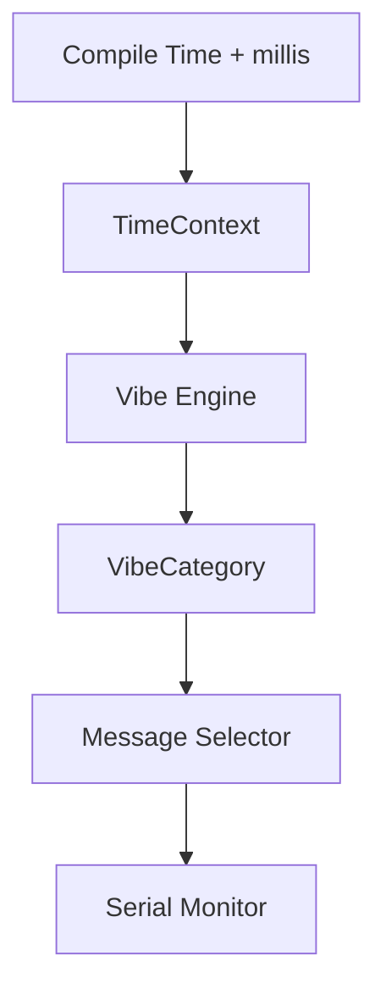

# Kalachakram 🎯

Traditional clocks suffer from one major flaw: they tell you the time.

Kalachakram is an intentionally unhelpful clock for TinkerHub Useless Projects 3.0. It maintains approximate time internally, works out which part of the day it is, and responds with a vague, sarcastic, context-aware description instead of a precise time.

```text
Normal clock:   04:47 PM
Kalachakram:   ALMOST EVENING.
               PROBABLY.
```

The current time determines the vibe category deterministically. Randomness is used only to select one phrase from the valid phrase pool for that vibe.

## Basic Details

### Team Name: Jilebi

### Team Members

- Team Lead: Rifan C Afsal -  Muthoot Institute of Technology and Science
- Member 2 : Sreehari R Nair - Muthoot Institute of Technology and Science

### Project Description

Kalachakram is an offline Arduino-based clock that knows approximate wall-clock time but considers displaying it precisely to be unnecessarily useful. The current firmware classifies time into eight parts of the day and prints one of 48 matching two-line messages to the Serial Monitor.

The 16×2 I²C LCD is part of the verified circuit design, but LCD output is not integrated into the current firmware yet.

### The Problem (that doesn't exist)

Ordinary clocks are far too cooperative. They provide exact information immediately, leaving no room for uncertainty, sarcasm, or a tiny machine judging your sleep schedule.

### The Solution (that nobody asked for)

Keep approximate time, hide the useful answer, and provide observations such as `MORNING-ISH. / GOOD ENOUGH.` or `BASICALLY SIX. / DON'T ARGUE.` instead.

## Current Status

### Implemented

- Approximate software timekeeping from the sketch's `__TIME__` compilation value plus elapsed `millis()`.
- A fixed-size `TimeContext` containing hour, minute, and second.
- Deterministic classification into eight time-of-day vibe categories.
- Six two-line phrases per category: 48 messages in total.
- Flash-backed phrase storage using AVR `PROGMEM`.
- Fixed 17-byte line buffers suitable for a 16-character display row plus null terminator.
- Random phrase selection only within the active vibe.
- Immediate-repeat prevention while remaining in the same category.
- Immediate reselection when the vibe category changes.
- Non-blocking phrase refresh every 60 seconds.
- One-second time/vibe diagnostics and message output through Serial at 9600 baud.
- Compile-time firmware test mode.

### Verified

- Source inspection confirms eight categories, six messages per category, and 48 initialized messages.
- A mechanical source check confirms that every message line is at most 16 characters.
- Source inspection confirms that the category classifier is deterministic and matches the documented boundaries.
- The Arduino Uno + 16×2 I²C LCD wiring has been validated in Tinkercad.

### Pending

- Arduino Uno compilation and upload verification in the current development environment.
- LCD integration in firmware; current output is Serial-only.
- Physical LCD I²C address scan.
- Physical Arduino Uno + LCD verification.
- Final enclosure and physical assembly.
- Screenshots, build photographs, and demo recording.

## Technical Details

### Technologies/Components Used

For Software:

- Arduino C/C++.
- Arduino core functionality through `Arduino.h`.
- AVR program-memory utilities through `avr/pgmspace.h`.
- Arduino IDE and Serial Monitor for the intended build/upload workflow.
- No external Arduino library is required by the current source.

Current source dependencies:

| Type | Dependency | Purpose |
|---|---|---|
| Arduino core | `Arduino.h` | `millis()`, `Serial`, `random()`, and `F()` |
| Standard integer types | `stdint.h` | Fixed-width integer types |
| Arduino AVR core/toolchain | `avr/pgmspace.h` | `PROGMEM`, `strcpy_P`, and `strlen_P` |

`Wire` and `LiquidCrystal_I2C` are not current dependencies because LCD firmware integration has not been implemented.

For Hardware:

- Arduino Uno or Uno-compatible board.
- 16×2 LCD with an attached I²C backpack.
- Breadboard.
- Jumper wires.
- USB cable.

### Time and Vibe Model

The firmware divides the day using the hour field of `TimeContext`:

| Time | Vibe category |
|---|---|
| 00:00–04:59 | `CURSED_HOURS` |
| 05:00–07:59 | `TOO_EARLY` |
| 08:00–10:59 | `MORNING` |
| 11:00–12:59 | `LUNCH_LOADING` |
| 13:00–15:59 | `AFTERNOON` |
| 16:00–17:59 | `DAY_IS_DYING` |
| 18:00–20:59 | `EVENING` |
| 21:00–23:59 | `GO_TO_BED` |

Classification never uses randomness. Once the category is known, the message selector chooses one of that category's six messages and excludes the immediately previous index.

### Message Storage and Arduino Uno Constraints

The message bank is declared as:

```cpp
const char vibe_messages[8][6][2][17] PROGMEM;
```

This represents eight categories, six messages per category, two lines per message, and 17 bytes per line including null termination. The static table occupies 1,632 bytes in Flash by declaration; that is not the total compiled firmware size.

Only the selected message is copied into two small fixed-size RAM buffers. The implementation uses no Arduino `String`, dynamic allocation, or STL containers, which helps respect the Arduino Uno's limited SRAM.

### Implementation

For Software:

# Installation

1. Clone or download this repository.
2. Keep `Kalachakram.ino` and all accompanying `.h` and `.cpp` files in the `Kalachakram` sketch directory.
3. Open `Kalachakram.ino` in Arduino IDE.
4. Select **Arduino Uno** as the board and choose the correct serial/COM port.
5. No external Arduino library is required by the current Serial-only firmware.

# Run

1. Compile and upload the sketch from Arduino IDE.
2. Open Serial Monitor at **9600 baud**.
3. Observe the initial selected message, the one-second time/vibe debug output, and message changes every 60 seconds or immediately at a category boundary.

The current sketch does not write to the LCD. The circuit below records the verified I²C wiring for the pending display-integration phase.

### Source Code Structure

| File | Responsibility |
|---|---|
| `Kalachakram.ino` | Main orchestration, non-blocking scheduling, Serial diagnostics, and test-mode control |
| `time_engine.h`, `time_engine.cpp` | Approximate software timekeeping using `__TIME__` and `millis()` |
| `vibe_engine.h`, `vibe_engine.cpp` | Vibe-category definitions and deterministic time classification |
| `messages.h`, `messages.cpp` | Flash-backed phrase bank, contextual selection, validation, and repeat prevention |

### Output Examples

These messages are copied directly from the current phrase bank:

```text
SUN IS UP.
I AM NOT.
```

```text
LUNCH IS
APPROACHING.
```

```text
WORK ENERGY
DECLINING.
```

```text
BASICALLY SIX.
DON'T ARGUE.
```

```text
WORK?
QUESTIONABLE.
```

```text
SLEEP EXISTS.
REMEMBER?
```

### Testing

#### Implemented logical tests

Setting `KALACHAKRAM_TEST_MODE` to `1` enables firmware tests for:

- Eight representative vibe-classification cases.
- Sixteen category-boundary cases.
- Message-line length validation against the 16-character limit.
- The expected 48-message count.
- Immediate-repeat detection across repeated selections in all categories.

#### Current execution evidence

- The test implementation and all 24 classification expectations have been inspected against the classifier.
- The current message initializer has been mechanically checked: 48 messages, six per category, and no line over 16 characters.
- No Arduino-side execution record is currently available in this workspace, so this README does not claim that the embedded tests passed on an Arduino Uno.

#### Physical hardware verification

- The four-wire Arduino Uno/I²C LCD connection is verified in Tinkercad.
- Physical Arduino and LCD behavior has not yet been verified.

### Limitations

- There is no RTC. Time begins at the sketch compilation time and advances using `millis()`.
- Reset or power loss restarts the software clock from that same compilation time, so this is an approximate hackathon prototype rather than a persistent standalone clock.
- The current firmware sends output only to Serial; LCD integration is pending.
- The physical LCD I²C address is still pending verification.
- Arduino Uno compilation is not yet independently verified in the current development environment.

### Future / Optional

A future version may add a DS3231 RTC, a physical “JUST TELL ME THE TIME” button, weekday-aware behavior, or a few special-time events. These are not present in the current implementation.

### Project Documentation

For Software:

# Screenshots (Add at least 3)

- Screenshot 1: To be added after final hardware integration.
- Screenshot 2: To be added after final hardware integration.
- Screenshot 3: To be added after final hardware integration.

# Diagrams



The diagram reflects the currently implemented Serial-only firmware. A final exported workflow image is still to be added.

For Hardware:

# Schematic & Circuit

Verified I²C wiring:

| I²C LCD | Arduino Uno |
|---|---|
| GND | GND |
| VCC | 5V |
| SDA | A4 |
| SCL | A5 |

On Arduino Uno, A4 is SDA and A5 is SCL. Because the LCD has an I²C backpack, the project does not require direct RS, E, or D4–D7 parallel wiring.

```text
Arduino Uno          16x2 I2C LCD

5V   --------------> VCC
GND  --------------> GND
A4   --------------> SDA
A5   --------------> SCL
```

The Arduino Uno + 16×2 I²C LCD wiring has been validated in Tinkercad. A circuit/schematic image will be added after the final build; physical hardware operation is still pending verification.

# Build Photos

- Components photo: To be added after physical build.
- Build-process photos: To be added after physical build.
- Final-build photo: To be added after physical build.

### Project Demo

# Video

Demo video: TBD.

# Additional Demos

Additional demo materials: TBD.

## Team Contributions

- Rifan C Afsal: Hardware and circuit — Tinkercad, Arduino/LCD wiring, breadboard work, hardware troubleshooting, and physical assembly.
- Sreehari R Nair: Software and integration — time engine, Vibe Engine, message engine, firmware integration, testing, and debugging.

---
Made with ❤️ at TinkerHub Useless Projects


